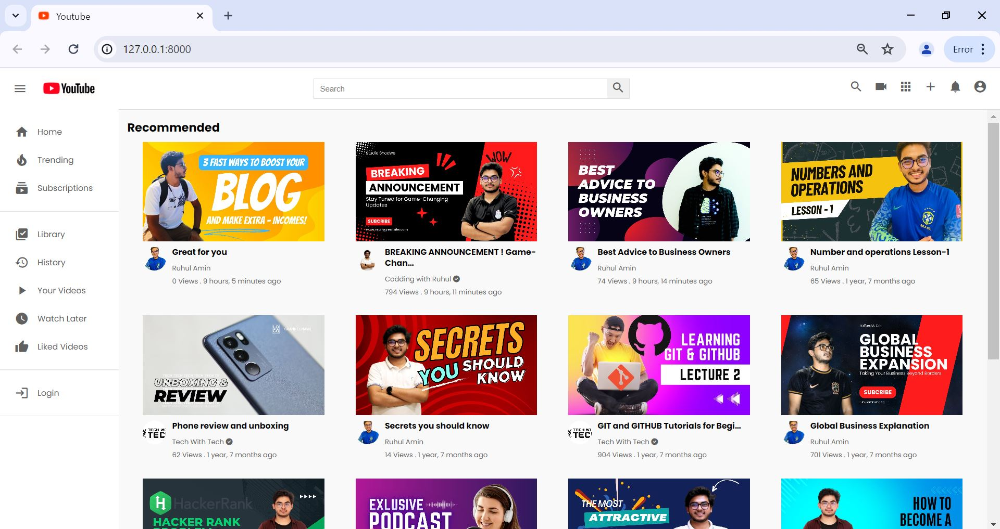
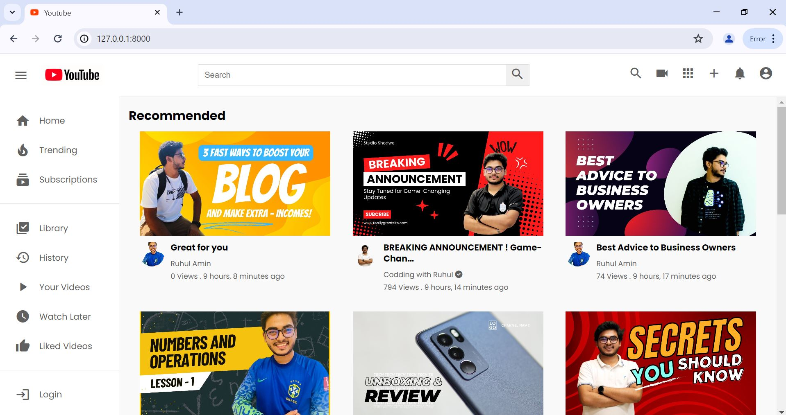
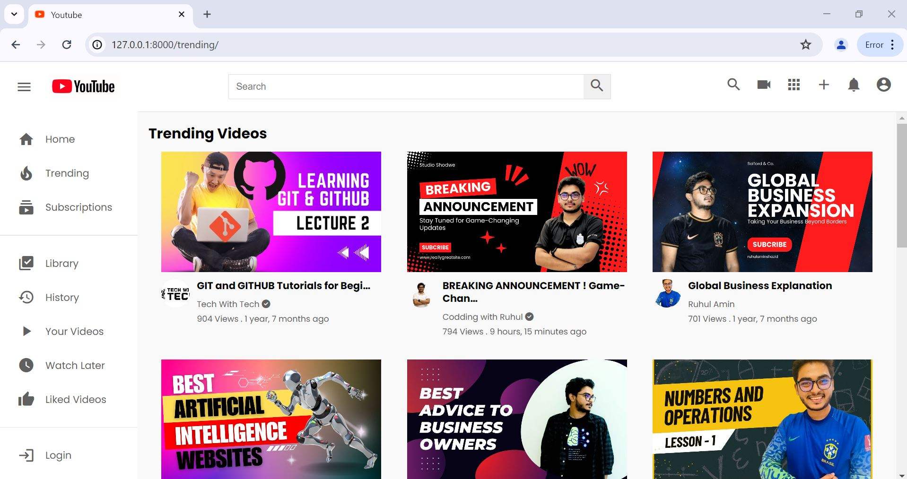
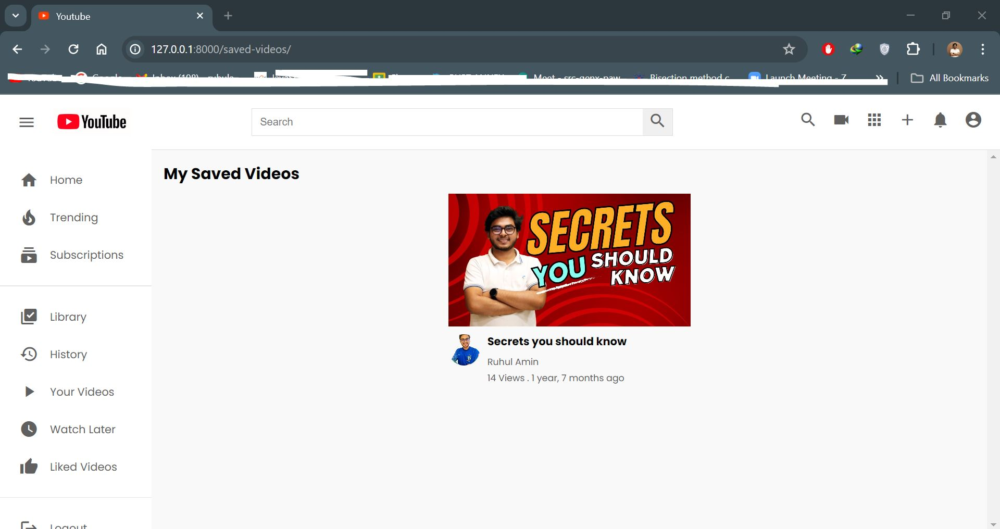
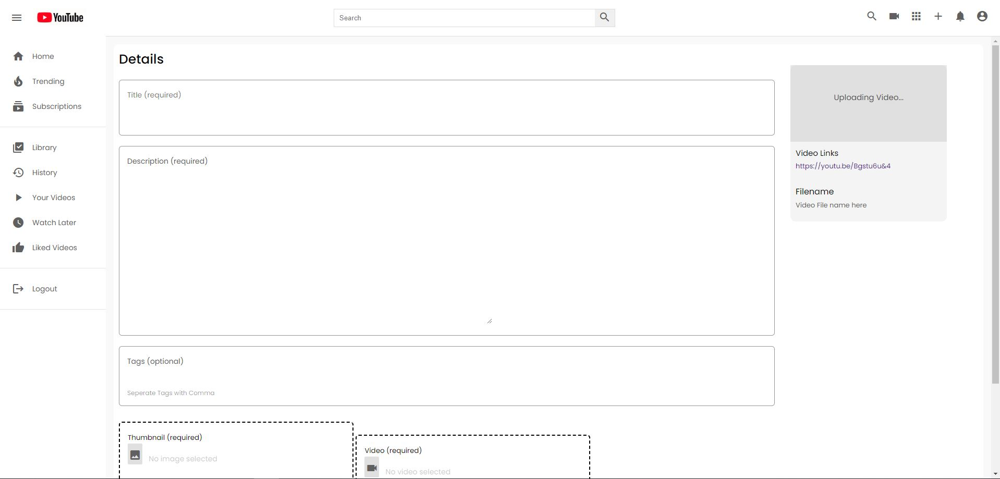
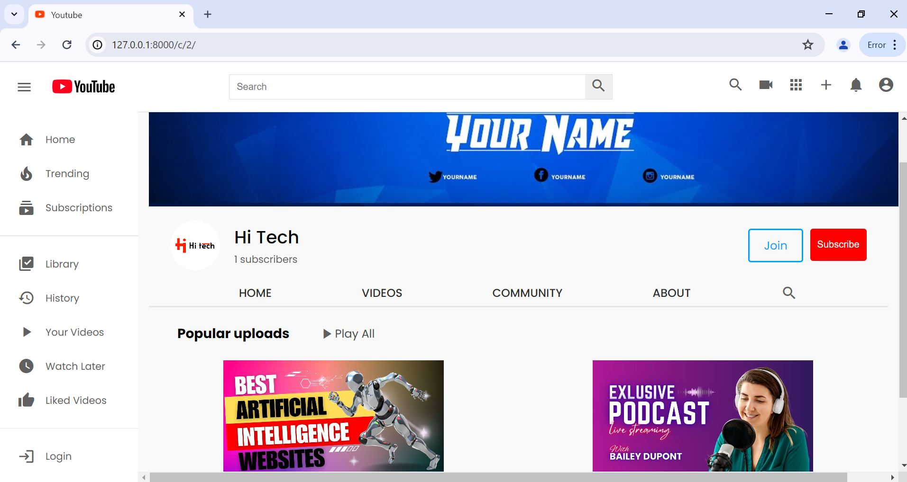
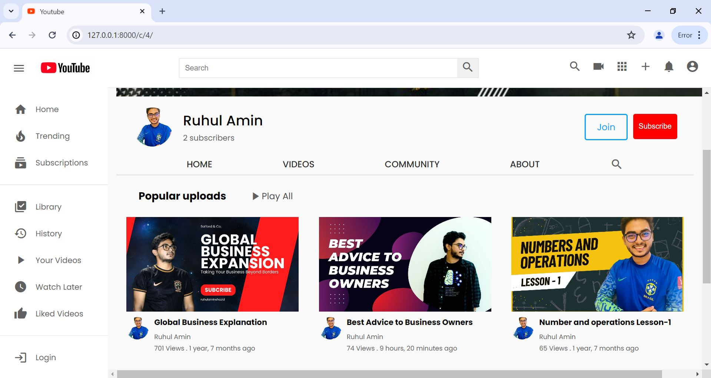

# YouTube Clone Project
Welcome to our YouTube clone project! This project allows users to upload, share, view, and comment on videos. Users can subscribe to channels and interact with content creators through comments and likes.

## Features

- User authentication and authorization
- Video upload and streaming
- Commenting system
- Likes and dislikes for videos
- Subscription to channels
- User profile management

## Frontend

The front end of this project is built using modern web technologies to ensure a smooth and responsive user experience. Below is a detailed explanation of the frontend part of our project.
### Sign-in page

### Technologies Used

- **React**: A JavaScript library for building user interfaces.
- **Redux**: A state management tool for managing the application state.
- **React Router**: A standard library for routing in React applications.
- **Axios**: A promise-based HTTP client for making requests to the backend.
- **CSS Modules**: For styling the components in a modular and reusable way.
- **Bootstrap**: For responsive design and pre-built components.

### Components

- **Header**: Contains the navigation bar with search functionality, user profile, and notifications.
- **Sidebar**: Displays navigation links to different sections like Home, Trending, Subscriptions, etc.
- **VideoCard**: A reusable component to display video thumbnails, titles, and other metadata.
- **VideoPlayer**: Handles the playback of videos with controls for play, pause, volume, etc.
- **CommentSection**: Manages the display and posting of comments on videos.

### Pages

- **HomePage**: Displays a list of videos categorized into different sections like trending, recommended, etc.
  
  
- **VideoPage**: Shows the video player, comments, and related videos.
  

  
  
  
  

  
- **ChannelPage**: Displays the channel information, list of videos, and option to subscribe.
  

  
  
  
  

  

### State Management

We use Redux for state management. The global state includes user authentication status, video details, comments, subscriptions, and more. The state is organized into different reducers to manage specific parts of the state tree.

### API Integration

We use Axios for making HTTP requests to the backend API. All API calls are managed in the `services/api.js` file. This file contains functions to handle user authentication, video uploads, fetching video data, posting comments, and more.

### Styling

The project uses CSS Modules for styling components in a modular and reusable manner. We also use Bootstrap for responsive design and pre-built UI components.

